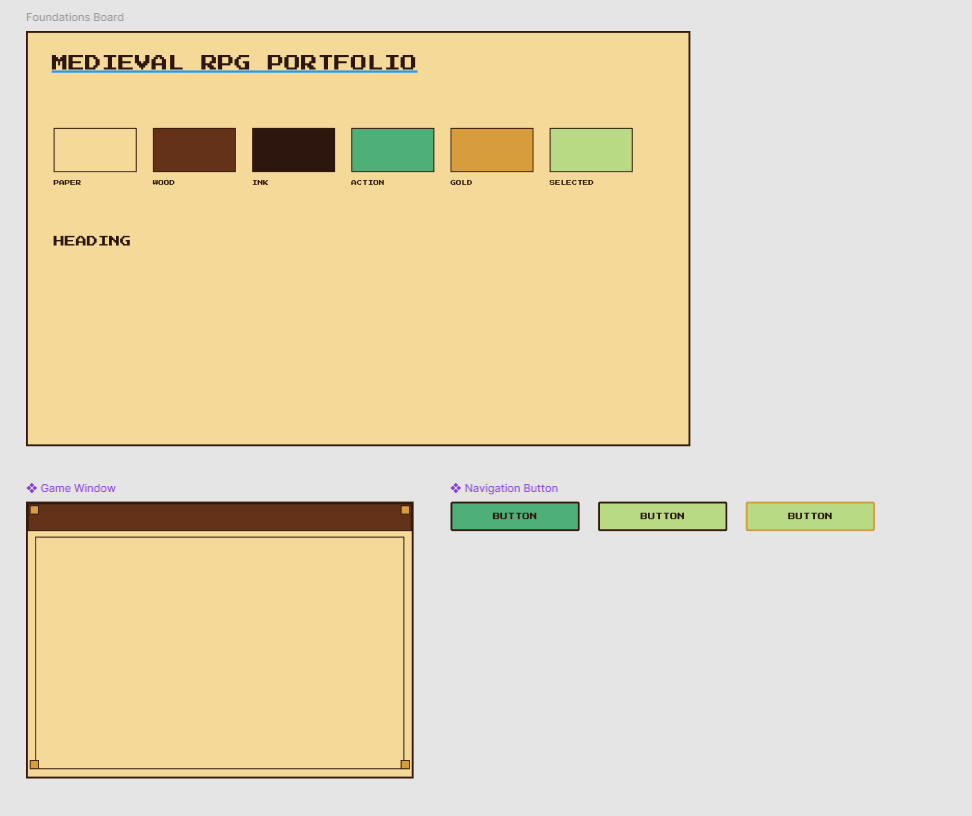
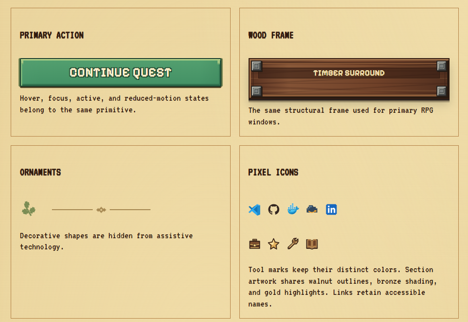

## Development

During one of my usual LinkedIn scrolling sessions over the last few weeks, I somehow came across a post by Bruno Paulino, an engineer at Buffer, about his new website: [bpaulino.com](https://bpaulino.com/).

His work immediately caught my attention.

He built the whole visual identity of his website around a terminal, which is the kind of thing nerds like me find brilliant. After seeing it, I simply couldn't rest until I had something like that for myself.

But I wanted to go a little deeper into the madness.

Instead of a terminal, I wanted to build a website around a cozy pixel-art/game-inspired design system. I mean, who doesn't like some Stardew Valley-style art, right?

Okay. The mission was clear.

Then came the obvious problem:

> "How the hell am I going to design all the components and styles that are floating around in my head?"

My first reaction was to open Figma and try to design everything myself because **design is my passion**.

It ended up looking like this 💀:

Yeah.

Definitely not the worst thing in the world, but also definitely not something that would spark joy in anyone visiting my website.

So I decided to abandon the idea of designing everything myself and give Astra 6's design skills a try.

I sent the WIP I had already created to Codex and explained the idea as clearly as I could, following the best guide I've found on the subject: PostHog's [Vibe Designing](https://posthog.com/newsletter/vibe-designing).

If you're as much of a design noob as I am, I highly recommend it.

A few iterations later, I ended up with a cozy [design system](https://bernardosevero.dev/system) that I was genuinely happy with.

Here's just a small spoiler, but I recommend checking out [bernardosevero.dev/system](https://bernardosevero.dev/system) to see the whole thing.

And well... you can probably imagine how the rest went.

Once I had the design system, I created a fresh repository and defined the features I wanted for the MVP:

- an About Me page
- my projects
- the books I'm reading
- and a posts section, which is probably where you're reading this right now

For the implementation, I decided to use **Astro + Vanilla CSS**, and I've been surprisingly impressed with Astro.

It feels almost purpose-built for this kind of website. I was able to get a functional version of the site up and running very quickly without introducing much unnecessary complexity.

For deployment, I bought the domain through Cloudflare and used **Cloudflare Pages + GitHub Actions** to deploy the static site.

---

## Tech stack

- [Astro](https://astro.build/) for static pages and content collections
- Vanilla CSS for styling
- Markdown/MDX for posts, projects, and book reviews
- A single JSON catalog for books
- [Playwright](https://playwright.dev/) + [axe-core](https://github.com/dequelabs/axe-core) for behavior, overflow, and automated accessibility checks

Feel free to check out the code for the MVP on GitHub:

[github.com/bernardosevero/bernardosevero.dev](https://github.com/bernardosevero/bernardosevero.dev)

And feel even more free to explore the actual website:

[bernardosevero.dev](https://bernardosevero.dev)
